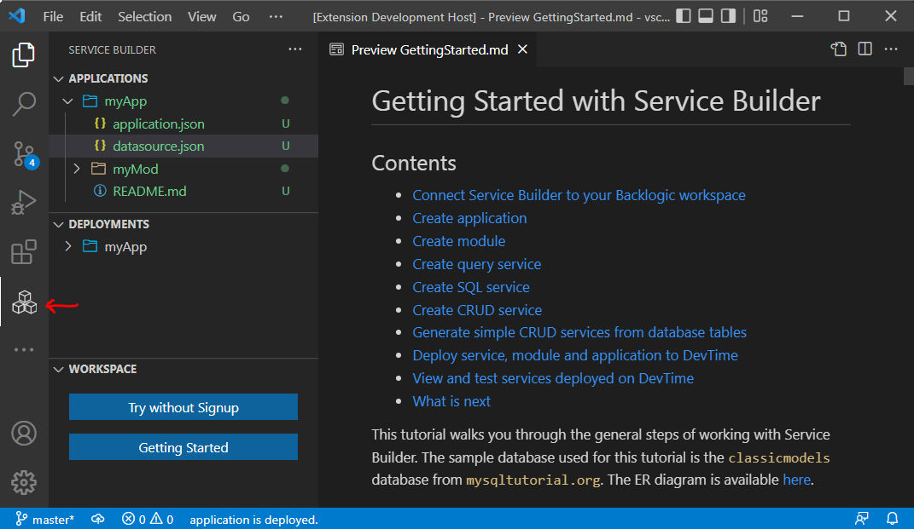
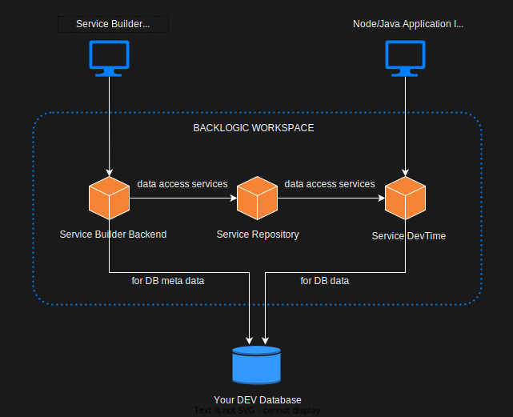

# Service Builder

The rapid development tool for data access services. The true SQL-first approach to relational data access.
>[visit our site](https://web.backlogic.net) to read more about data access service and BackLogic platform.

# Features

- Application Explorer
  - Create application
  - Create module
  - Create query, SQL and CRUD services, and
  - Deploy application, module and sevice to DevTime  
  
- Deployment Explorer
  - View applications deployed on DevTime
  - Test services deployed on DevTime, and
  - Clean up applications deployed on DevTime

- Workspace Explorer
  - Connect Service Builder to BackLogic workspace
  - Try-without-Signup service
  - Getting Started tutorial

# BackLogic Workspace

Service Builder VScode is just the UI. It must connect to a BackLogic workspace to work. The BackLogic workspace is your virtual private develpment environment for data access services.  

Inside the workspace are the Service Builder Backend, Service Repository and Service DevTime. The Service Builder Backend does the heavy lifting for Service Builder, and deploys the data access services into the Service Repository. The Service Devtime runs the data access services from the Service Repository for development purpose. Both the Service Builder and Service Devtime connects to your DEV database, for DB meta data and DB data, respectively.

# Usage

- Use Workspace Explorer to connect to BackLogic workspace
- Use Application Explorer to develop and deploy application, module and services
- Use Deployment Explorer to view and test applications and services deployed on DevTime.

# Install

Press F1, type ext install then search for service-builder.

# Get Started

Once you have Service Builder installed, open the Getting Started tutorial from the Workspace Explorer, and follow the instructions to create your first data access application.

If you have aleady signed up with BackLogic, you may get your the workspace url and access token from the Service Console for workspace connection. You also need a DEV database of your own, with the [`ClassicModels`](https://www.mysqltutorial.org/mysql-sample-database.aspx) sample database pre-installed.

However, if you are trying without signup, Service Builder will assign you a quest workspace with a guest database. It will also create the application and module for you, so that you can directly jump on creating query, SQL and CRUD services. Try without Signup is a quick way to get your hands dirty with data access services.

# Recommeded VSCode Extensions

- [REST Client](https://marketplace.visualstudio.com/items?itemName=humao.rest-client)  
  A great HTTP client tool. Required for testing data access service from Deployment Explorer.
- [JSON Grid Viewer](https://marketplace.visualstudio.com/items?itemName=DutchIgor.json-viewer)  
  A great tool for viewing input, output and table bindings in tabular form. Required for `open with json viewer` function for the input, output and table binding files.
- [Database Client](https://marketplace.visualstudio.com/items?itemName=cweijan.vscode-database-client2)  
  A good database tool for testing SQLs in data access service.
- [Paste JSON as Code](https://marketplace.visualstudio.com/items?itemName=quicktype.quicktype)  
  Helpful if you want to generate classes of various languages from service input, output, and object.

# Release Notes

## 0.0.1

Initial release.

# Feedback

Email ken@backlogic.net
