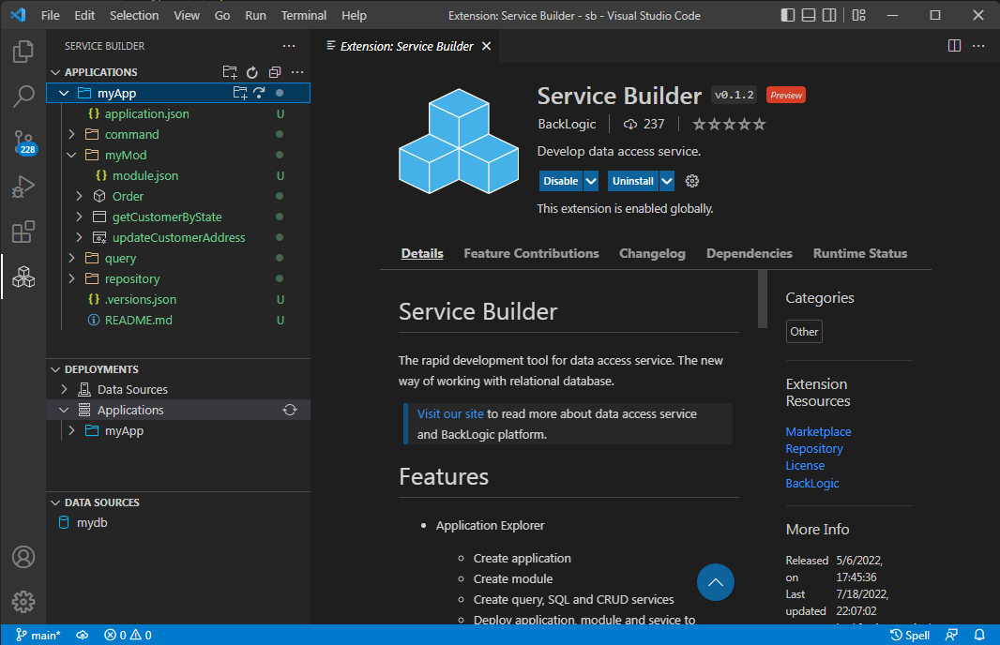
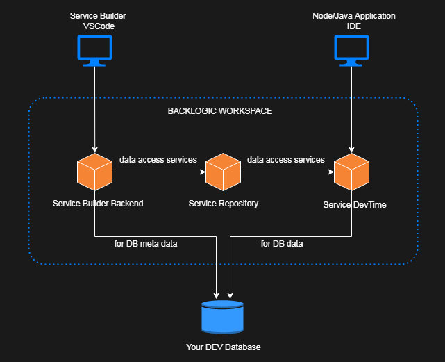

# Service Builder

The development tool for data access service (DAS). DAS provides developer with
- the flexibility of querying and persisting aggregate object of complex shapes from/into relational database, and
- the simplicity of specifying query, command and repository services with SQL and JSON only.

>[Visit here](https://docs.backlogic.net) to read more about data access service.  

# Get Started

Follow the get started tutorials for `Service Builder` and `data access service`:

[`Get Started with Service Builder`](https://docs.backlogic.net/#/GetStarted/get-started-with-service-builder.md)  
[`Get Started with Data Access Service`](https://docs.backlogic.net/#/GetStarted/get-started-with-data-access-service.md)  

# Features

- Application Explorer
  - Request and connect to remote workspace
  - Create application and module
  - Create and test query, SQL/command and CRUD/repository services
  - Deploy application, module and service to remote workspace
  
- Data Source Explorer
  - Create and deploy data source to remote workspace

- Deployment Explorer
  - Inspect applications and data sources deployed in remote workspace
  - Test services deployed in remote workspace
  

# Remote Workspace

`Service Builder` must connect to a remote workspace to work. The remote workspace hosts the `Service Builder Backend` that does the heavy lifting for Service Builder. It also hosts a DevTime `data access server` that serves the data access services deployed in the workspace to support client application development.

The remote workspace can be requested from inside of `Service Builder`.

# Usage

Follow the get started tutorial for `Service Builder`:

- Request and connect to remote workspace with Application Explorer
- Create and deploy data source with Data Source Explorer
- Create, test and deploy application, module and services with Application Explorer
- Inspect and test application and services deployed into remote workspace

# Install

Click `Extensions` on `Activity Bar`, and then search for `service builder pack`.

# Required VSCode Extensions

The following VS Code extensions are required by some functionalities of `Service Builder`, and are included with `Service Builder Pack`.

- [REST Client](https://marketplace.visualstudio.com/items?itemName=humao.rest-client)  
  A great HTTP client tool. Required for testing data access service from Deployment Explorer.

- [JSON Grid Viewer](https://marketplace.visualstudio.com/items?itemName=DutchIgor.json-viewer)  
  A great tool for viewing JSON array as table. Required to view data bindings as JSON file and JSON grid side by side.

# Recommended VSCode Extensions

Data access service development is mainly SQL development. The following VS Code extension is recommended for creating a SQL environment within VS Code. 

- [Database Client](https://marketplace.visualstudio.com/items?itemName=cweijan.vscode-database-client2)  

  An excellent database tool for MySQL, PostgreSQL and others. 

# Feedback

Email ken@backlogic.net
