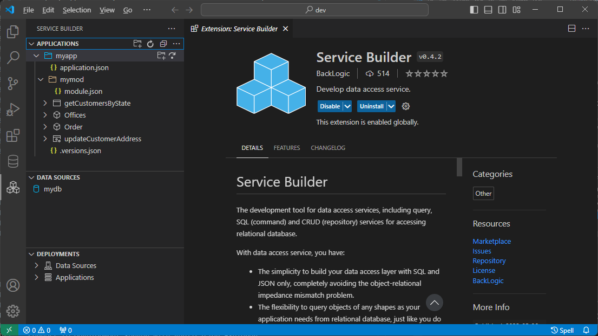
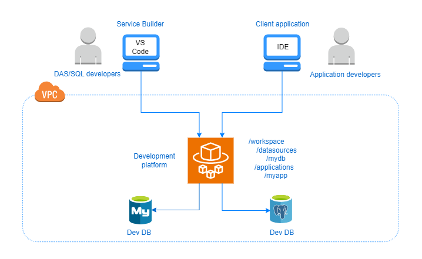

# Service Builder

The development tool for data access services, including query, SQL (command) and CRUD (repository) services for accessing relational database.

With data access service, you have:
- The simplicity to build your data access layer with SQL and JSON only, completely avoiding the object-relational impedance mismatch problem.
- The flexibility to query objects of any shapes as your application needs from relational database, just like you do from document database.

>For more information about data access services, visit [data access service concepts](https://www.backlogic.net/docs/concepts/).  

# Get Started

Follow the getting-started tutorials for `Service Builder` and `data access service`:

[`Getting Started with Service Builder`](https://www.backlogic.net/docs/getting-started/service-builder/)  
[`Getting Started with Data Access Service`](https://www.backlogic.net/docs/getting-started/data-access-service/)  

# Features

- Application Explorer
  - Connect to remote workspace hosted on Development Server.
  - Create application and module.
  - Create and test query, SQL command and CRUD repository services.
  - Deploy application, module and service to remote workspace.
  
- Data Source Explorer
  - Create and deploy data source to remote workspace.

- Deployment Explorer
  - Inspect data sources and applications deployed in remote workspace.
  - Test services deployed in remote workspace.  

# Development Server

`Service Builder` must connect to a `Development Server` to work. The `Development Server` provides backend services to the `Service Builder` and hosts development workspaces for users. Data access services can be deployed into a workspace on the `Development Server` and accessed through the service endpoint of the workspace by a client application in development for data access needs, as shown below:

The `Development Server` is meant to be launched as a data access development platform in the cloud using a container service like AWS Fargate, so that different data access, as well client application, developers can work on the same `Development Server`. However, the `Development Server` can also be launched on the local machine for local development.

# Usage

Follow the `Getting Started with Service Builder` tutorial:

- Connect to Development Server with Application Explorer.
- Create and deploy data source with Data Source Explorer.
- Create, test and deploy application, module and services with Application Explorer.
- Inspect and test application and services deployed into remote workspace.

# Install

Click `Extensions` on `Activity Bar` and search for `service builder extension pack`.

# Required VSCode Extensions

The following VS Code extensions are required by some parts of `Service Builder` and are included with `Service Builder Extension Pack`.

- [REST Client](https://marketplace.visualstudio.com/items?itemName=humao.rest-client)  
  A great HTTP client tool. Required for testing data access service from Deployment Explorer.

- [JSON Grid Viewer](https://marketplace.visualstudio.com/items?itemName=DutchIgor.json-viewer)  
  A great tool for viewing JSON array as table. Required to view data bindings as JSON file and JSON grid side by side.

# Recommended VSCode Extensions

Data access service development is mainly SQL development. The following VS Code extension is recommended for creating a SQL environment within VS Code. 

- [Database Client](https://marketplace.visualstudio.com/items?itemName=cweijan.vscode-database-client2)  

  An excellent database tool for MySQL, PostgreSQL and others. 

# Feedback and Support

[BackLogic Discussion](https://github.com/bklogic/backlogic-project/discussions/categories/general)
