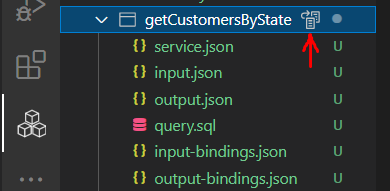

# Getting Started with Service Builder

## Contents

- [Connect Service Builder to your Backlogic workspace](#connect-service-builder-to-your-workspace)
- [Create application](#create-application)
- [Create module](#create-module)
- [Create query service](#create-query-service)
- [Create SQL service](#create-sql-service)
- [Create CRUD service](#create-crud-service)
- [Generate simple CRUD services from database tables](#generate-simple-crud-services-from-database-tables)
- [Deploy service, module and application to DevTime](#deploy-service-module-and-application-to-devtime)
- [View and test services deployed on DevTime](#view-and-test-and-services-deployed-on-devtime)
- [What is next](#what-is-next)

This tutorial walks you through the general steps of working with Service Builder. The sample database used for this tutorial is the `classicmodels` database from `mysqltutorial.org`. The ER diagram is available [here](https://www.mysqltutorial.org/mysql-sample-database.aspx).  

> Tip: It may be helpful if you have this tutorial next to your SQL and JSON editors when working through the examples in this tutorial.

## Prerequisite

- A BackLogic account, so that you can connect to a BackLogic workspace.
- A MySql database accesible from BackLogic workspace and pre-loaded with the `classicmodels` database.

If you already signed up a BackLogic account, the BackLogic workspace connection information and the IP address may be found from Service Console.

However, if you are trying without signup, you will be assigned with a guest workspace and a guest database. After you start the try session, the application and module are automatically created for you, and you may jump to the [create query service](#create-query-service) section directly.

Otherwise, start from here.

## Connect Service Builder to Your Workspace

1. Get your workspace URL and access token from Service Console

2. Connect to your workspace
    - Move mouse over `WORKSPACE` explorer and click `Connection`  and then click the `Connect` button on the information box.
    - Paste your workspace URL in the input box opened, and hit Enter.
    - Paste you access code in the next input box opened, and hit Enter.

   Service Builder is connected to your BackLogic workspace.

   

## Create Application

1. Generate Application
    - Move mouse over `APPLICATIONS` explorer and click `New Application`  icon.
    - Enter "myApp" as application name. Hit Enter.
    - Select "mysql" as database type.  Hit Entry.

    Application is generated in seconds.

   

2. Configure Data Source
    - Open `datasource.json` file.
    - Edit the host, port, database, username and password fields.
    - Click `Test and Deploy Data Source Configuration`  button to test database connection. If successful, the data source configuration will be automatically deployed to DevTime with the password encryped, and saved to your local file with the password masked.

   

## Create Module

1. Generate Module
    - Move mouse over `myApp` application and click `New Module`  icon.
    - Enter "myMod" as module name. Hit Enter.

    Module is generated in seconds for application `myApp`.

   

## Create Query Service

> Note: Here we are to create a query service to return a list of customers of complex structure by state.

1. Generate service
    - Move mouse over `myMod` module and click `New Query Service`  icon.
    - Enter `getCustomersByState` as service name. Hit Enter.

    Service is generated in seconds.

   

2. Compose input
    - Copy and paste the following into `input.json` file, save and review.

    ```json
    {
        "state": "CA"
    }
    ```

3. Compose output
    - Copy and paste the following into `output.json` file, save and review.

    ```json
    [{
        "customerNumber": 124,
        "customerName": "Mini Gifts Distributors Ltd.",
        "phone": "4155551450",
        "address": {
            "address": "5677 Strong St.",
            "city": "San Rafael",
            "state": "CA",
            "country": "USA"
        },
        "salesRep": {
            "employeeNumber": 1165,
            "lastName": "Jennings",
            "firstName": "Leslie",
            "office": "San Francisco-USA"
        },
        "orders": [{
            "orderNumber": 10113,
            "orderDate": "2003-03-26T00:00:00.000Z",
            "status": "Shipped",
            "comments": "shipped on time",
            "orderLines": [
                {
                    "orderLineNumber": 1,
                    "productCode": "S32_3522",
                    "productName": "1996 Peterbilt 379 Stake Bed with Outrigger",
                    "quantityOrdered": 23,
                    "priceEach": 58.82
                }
            ]
        }]
    }]
    ```

4. Compose query
    - Copy and paste the following into `query.sql` file, save and review.

    ```sql
    select c.customerNumber, c.customerName, c.phone, 
        c.addressLine1 as address, c.city, c.state, c.country,
        e.employeeNumber, e.lastName, e.firstName, 
        concat(o.city, '-', o.country) as office,
        ord.orderNumber, ord.orderDate, ord.status, ord.comments,
        od.orderLineNumber, p.productCode, p.productName, 
        od.quantityOrdered, od.priceEach
    from customers c, 
        employees e, 
        offices o, 
        orders ord,
        orderdetails od, 
        products p
    where e.employeeNumber = c.salesRepEmployeeNumber
    and o.officeCode = e.officeCode
    and ord.customerNumber = c.customerNumber
    and od.orderNumber = ord.orderNumber
    and p.productCode = od.productCode
    and c.state = :state
    order by c.customerNumber, ord.orderNumber, od.orderLineNumber
    ```

5. Generate input and output Bindings
    - Move mouse over `getCustomersByState` service and click `Generate Input and Output Bindings`  icon.
    - Open `input-bindings.json` and `output-bindings.json` files to review the input and output bindings.
    - Mouse over the `input-bindings.json` and `output-bindings.json` files and click the `Open with Json Viewer`  icon to view the input and output bindings in tabular form.
    - Edit input and output bindings if necessary (skip).

    

    > You must have the `json grid viewer` installed to open the input and output bindings file with json viewer.

6. Test Service
    - Move mouse over `Tests` folder and click `Add Test`  icon, to generate a test file.
    - Review and edit input parameters in the `testGetCustomerByState.json` file generated. It should looks like:

    ```json
      {
        "name": "getCustomersByState",
        "input": {
            "state": "CA"
        }
      }
    ```

    - click `Run Test`  button to test the service.

      The service output, or exception if error, shows in an output panel.

    

## Create SQL Service

> Note: here we are to create a SQL command service to clone and return a product line and its products.

1. Generate service
    - Move mouse over `myMod` module and click `New SQL Service`  icon.
    - Enter `cloneProductLine` as service name. Hit Enter.

    Service is generated in seconds.

   

2. Compose input
    - Copy and paste the following into `input.json` file, save and review.

    ```json
    {
        "scourceProductLine": "Classic Cars",
        "newProductLine": "Electric Cars"
    }
    ```

3. Compose the optional output
    - Copy and paste the following into `output.json` file, save and review.

    ```json
    {
    "productLine": "Electric Cars",
    "description": "Make your wildest car ownership dreams come true.",
    "products": [{
        "productCode": "S10_1949",
        "productName": "1952 Alpine Renault 1300",
        "productDescription": "",
        "productVendor": "Classic Metal Creations",
        "buyPrice": 98.58,
        "msrp": 214.3
        }]
    }
    ```

4. Compose SQLs
    - Copy and paste the following into `sqls.sql` file, save and review.

    ```sql
    insert into productlines (
    productLine, textDescription, htmlDescription, image
    )
    select :newProductLine, textDescription, htmlDescription, image
    from productlines
    where productLine = :scourceProductLine
    ;

    insert into products (
    productCode, productName, productLine, productScale, productVendor, productDescription, quantityinStock, buyPrice, MSRP
    )
    select concat('N_', productCode) as productCode, productName, :newProductLine, productScale, productVendor, productDescription, 0, buyPrice, MSRP
    from products
    where productLine = :scourceProductLine
    ```

5. Compose the optional query
    - Copy and paste the following into `query.sql` file, save and review.

    ```sql
    select pl.productLine, pl.textDescription as description,
        p.productCode, p.productName, productVendor,
        p.productDescription, buyPrice, MSRP
    from products p, productlines pl
    where p.productLine = pl.productLine
        and p.productLine = :newProductLine
    ```

6. Generate input and output Bindings
    - Move mouse over `cloneProductLine` service and click `Generate Input and Output Bindings`  icon.
    - Open `input-bindings.json` and `output-bindings.json` files to review the input and output bindings.
    - Mouse over the `input-bindings.json` and `output-bindings.json` files and click the `Open with Json Viewer`  icon to view the input and output bindings in tabular form.
    - Edit input and output bindings if necessary (skip).

7. Test Service
    - Move mouse over `Tests` folder and click `Add Test` , to generate a test file.
    - Review and edit input parameters in `testCloneProductLine.json` file.  It should looks like:

    ```json
      {
        "name": "testCloneProductLine",
        "input": {
            "scourceProductLine": "Classic Cars",
            "newProductLine": "Electric Cars"
        },
        "comments": "Modify the example test name and input."
      }    
    ```

    - click `Run Test`  button or `Run Test without Commit`  button to test the service.

      The service output, or exception if error, shows in an output panel.

## Create CRUD Service

> Note: here we are to create a CRUD service for `Order` object. For CRUD service, read and write may be asymmetric. You will see in this example, the read operation reads from 4 tables but the write operations only write to 2 tables.

1. Generate service
    - Move mouse over `myMod` module and click `New CRUD Service`  icon.
    - Enter `Order` as service name. Hit Enter.  

    Service is generated in seconds.

   

2. Compose object
    - Copy and paste the following into `object.json` file, save and review.

    ```json
    {
        "orderNumber": 10101,
        "orderDate": "2003-01-09T00:00:00.000Z",
        "requiredDate": "2003-01-09T00:00:00.000Z",
        "shippedDate": "2003-01-09T00:00:00.000Z",
        "status": "Shipped",
        "comments": "Check on availability.",
        "customerNumber": 128,
        "customerName": "Blauer See Auto, Co.",
        "orderLines": [{
            "orderLineNumber": 1,
            "productCode": "S18_2795",
            "productName": "1928 Mercedes-Benz SSK",
            "quantityOrdered": 26,
            "priceEach": 167.06
        }]
    }
    ```

For Read,

3. Compose READ input
    - Copy and paste the following into `input.json` file, save and review.

```json
{
    "orderNumber": 10101,
    "customerNumber": 128,
    "startDate": "2003-01-09T00:00:00.000Z",
    "endDate": "2003-06-09T00:00:00.000Z"
}
```

4. Compose READ query
    - Copy and paste the following into `query.sql` file, save and review.

    ```sql
    select ord.orderNumber, ord.orderDate, 
           ord.requiredDate, ord.shippedDate,
           ord.status, ord.comments,
           ord.customerNumber, _c.customerName,
           od.orderLineNumber, od.productCode, _p.productName, 
           od.quantityOrdered, od.priceEach
    from orders ord
    join customers _c on ord.customerNumber = _c.customerNumber
    left join orderdetails od on od.orderNumber = ord.orderNumber
    left join products _p on _p.productCode = od.productCode
    where 1 = 1
      and ord.orderNumber = :orderNumber
      and ord.customerNumber = :customerNumber
      and ord.orderDate between :startDate and :endDate
    order by ord.orderNumber, od.orderLineNumber
    ```

5. Generate input and output Bindings
    - Move mouse over the `read` component and click `Generate Input and Output Bindings`  icon.
    - Open the `input-bindings.json` and `output-bindings.json` files to review the input and output bindings.
    - Mouse over the `input-bindings.json` and `output-bindings.json` files and click the `Open with Json Viewer`  icon, to view the input and output bindings in tabular form.
    - Edit the input and output bindings if necessary (skip).

   

For write,

6. Generate table bindings
    - Move mouse over the `write` component and click `Generate Table Bindings`  icon.
    - open the `tables.json`, `order.columns.json` and `orderdetail.columns.json` files to review the table and column bindings.
    - Mouse over the `order-column-bindings` and `orderdetail-column-bindings.json` files and click the `Open with Json Viewer`  icon, to view the column bindings in tabular form.
    - Edit tables and columns bindings if necessary (skip).

   

7. Test Service
    - Move mouse over `Tests` folder and click `Add Test` , and then select `all` , to generate a test file for each CRUD operation;

    For `read` test,
    - Mouse over the `testReadOrder.json` file and click `Duplicate`  icon twice, to duplicate two more read tests;
    - Rename the three read test files to `testReadOrderByOrderNumber.json`, `testReadOrderByCustomerNumber.json` and `testReadOrderByDates.json`, repectively.
    - Edit the `testReadOrderByOrderNumber.json` file and make it looks like:

    ```json
    {
        "name": "testReadOrderByOrderNumber",
        "input": {
            "orderNumber": 10101
        },
        "operation": "read"
    }
    ```

    - Click `Run Test`  button to test the service.

      The service output, or exception if error, shows in an output panel.

    - Edit the `testReadOrderByCustomerNumber.json` file and make it looks like:

    ```json
    {
        "name": "testReadOrderByCustomerNumber",
        "input": {
            "customerNumber": 128
        },
        "operation": "read"
    }
    ```

    - click `Run Test`  button to test the service.

      The service output, or exception if error, shows in an output panel.

    - Edit `testReadOrderByDates.json` file and make it looks like

    ```json
    {
        "name": "testReadOrderByDates",
        "input": {
            "startDate": "2003-01-09T00:00:00.000Z",
            "endDate": "2003-06-09T00:00:00.000Z"
        },
        "operation": "read",
        "comments": "Modify the example test name and input."
    }
    ```

    - Click `Run Test`  button to test the service.

      The service output, or exception if error, shows in an output panel.

    For `create` test,
    - open `testCreateOrder.json` file, and make it look like:

    ```json
    {
        "name": "testCreateOrder",
        "input": {
            "orderNumber": 10,
            "orderdate": "2021-01-01T00:00:00.000Z",
            "status": "In Process",
            "comments": "my comments",
            "customerNumber": 103,
            "customerName": "abc",
            "orderLines": [
                {
                    "orderlineNumber": 12301,
                    "productCode": "S12_1099",
                    "productName": "1968 Ford Mustang",
                    "quantityOrdered": 12,
                    "priceEach": 123456
                }
            ]
        },
        "operation": "create"
    }
    ```

    - Click `Run Test`  or `Run Test without Ccommit`  button to test the service.

      The service output, or exception if error, shows in an output panel.

   

## Generate Simple CRUD Services from Database Tables

To generate a simple CRUD service for `office` table:

- Right-click `myMod` module, and select `Generate CRUD from Table`.
- Select table "office". Hit Enter.
- Select name convention "none". Hit Enter.

A simple CRUD service is generated in seconds.


## Deploy Service, Module and Application to DevTime

> The application and module are automatically deployed to DevTime upon creation. The service are automatically deployed to DevTime upon a successful test. However, you may deploy a service, a module or a whole application manually anytime as you please. Once deployed, the services are accesible through the DevTime endpoint.

1. Deploy service to DevTime
    - Right-click `getCustomersByState` service, and select `Deploy Service`, to deploy the service.

The service is deployed in seconds.

2. Deploy module to DevTime
    - Right-click `myMod` module, and select `Deploy Module`, to deploy the module.

The module is deployed in seconds.

3. Deploy application to DevTime
    - Right-click `myApp` application, and select `Deploy Application`, to deploy the application.

The application is deployed in seconds.

## View and Test and Services Deployed on DevTime

1. View Service

    - Mouse over `DEPLOYMENTS` explorer, and click `Refresh Application List` icon.

    A list of application is displayed.

    - Mouse over `myApp` application, and click `Refresh Application` icon.

    A list of services of the applications is displayed.

2. Test Service

    - Mouse over `getCustomersByState` and click `Generate Tests` icon, to generate a `tests.http` file.
    - Open the `tests.http` file, and click any `Send Request` line you see to test the service.


> You must have the [Rest Client](https://marketplace.visualstudio.com/items?itemName=humao.rest-client) extension installed, in order to run the tests in the `tests.http` file.

## Push Data Access Application Into Your Git Repository

The Service Build automatically initialize a git repositoty for your application. To push the application into your remote repository,

- Create a remote repository with GitHub, GitLab or other.
- Go to the `Source Control` extension of VSCode.
- Add your remote repository to the application.
- Add and commit the changes.
- Push the application into the remote repository.

Or you may use GIT bash to perform the above actions.

## What Is Next

Read [Data Access Service Concepts](https:/backlogic.net) when it is available.
